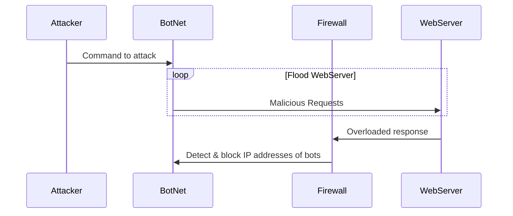

### Step-by-Step Explanation
1. The attacker sends the command to start the attack to the botnet.
2. The botnet floods the webserver by repeatedly sending over malicious traffic.
3. The webserver is overloaded. This triggers it to send a response to the firewall.
4. The firewall receives the response from the webserver, analyzes the traffic, and blocks the IP addresses of the bots that were flooding the webserver. The DDoS attack is thereby subjugated.
